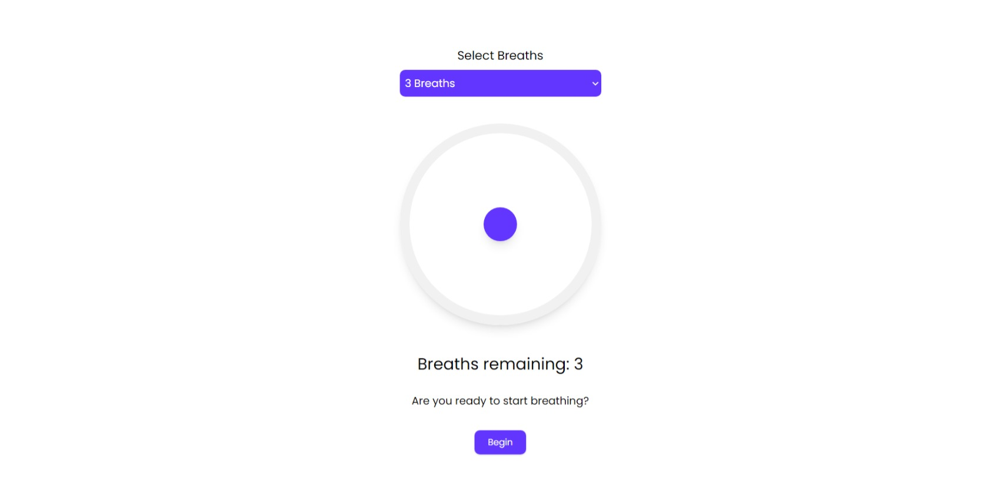

# Meditation App


 Meditation App is a fully responsive website, responsive for all devices, built using React.

## Demo




## Prerequisites

Before you begin, ensure you have met the following requirements:

* [Git](https://git-scm.com/downloads "Download Git") must be installed on your operating system.

## Installing Meditation App

To install **Meditation App**, follow these steps:

Linux and macOS:

```bash
sudo git clone https://github.com/PrakasRavichandran/simple-medition-app.git
```

Windows:

```bash
git clone https://github.com/PrakasRavichandran/simple-medition-app.git
```

## Contact

If you want to contact me you can reach me at [Instagram](https://www.instagram.com/prakashravichandrann/).

## License

This project is **free to use** and does not contains any license.
